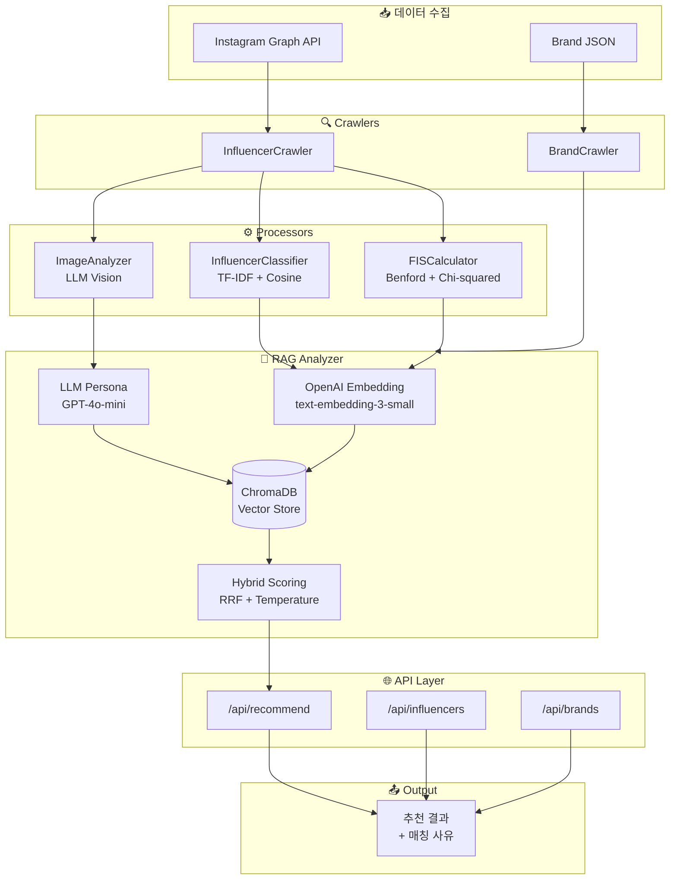
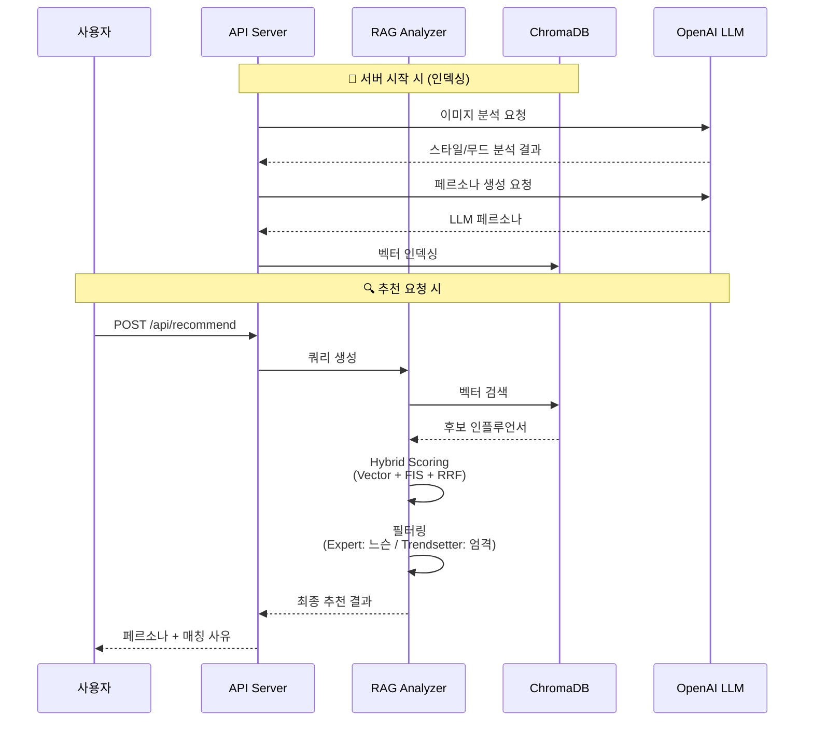
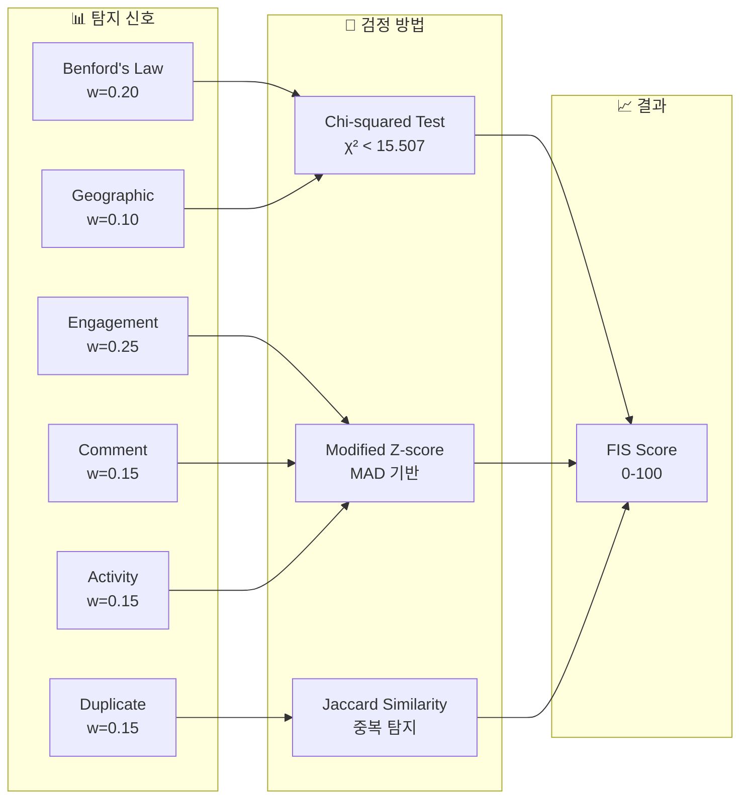
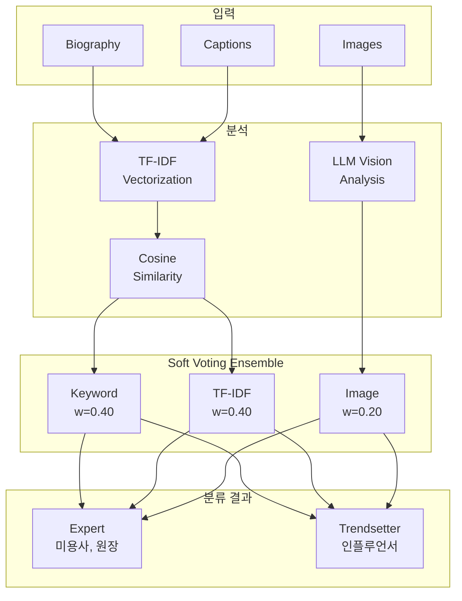
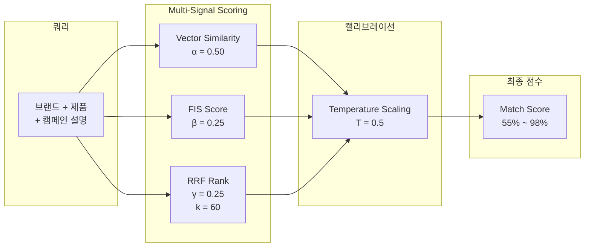
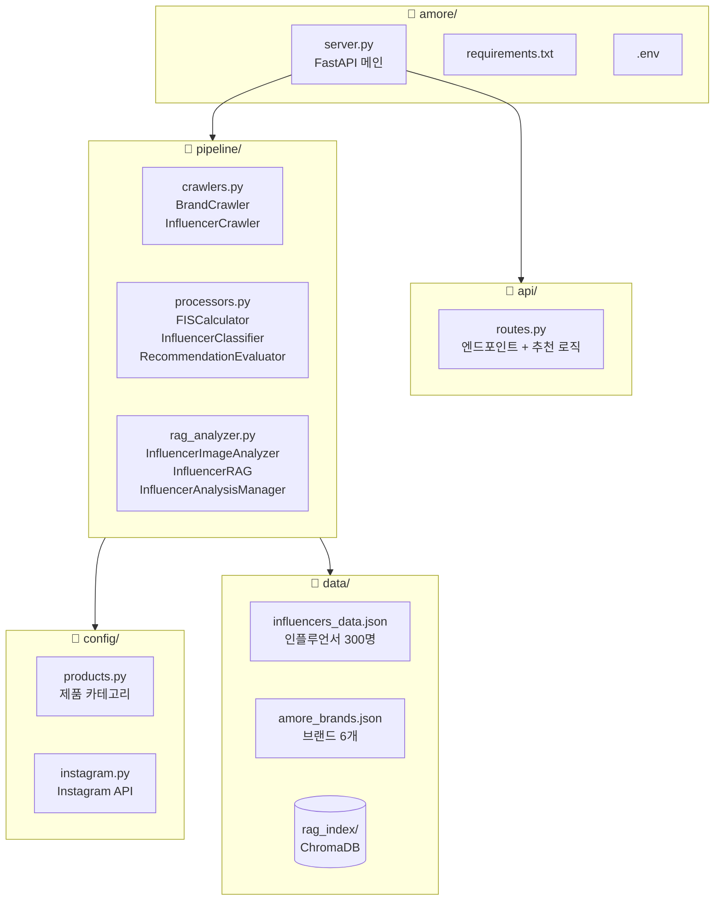
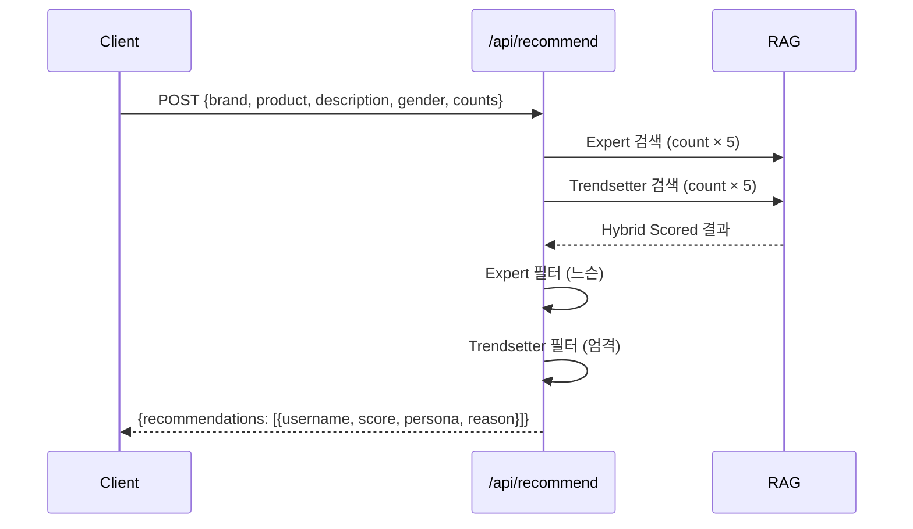

# AI 헤어 인플루언서 큐레이션 에이전트

아모레퍼시픽 헤어 브랜드와 인플루언서 최적 매칭을 위한 **학술적 알고리즘 기반** RAG AI 추천 시스템

## 핵심 특징

- **학술적 알고리즘 기반**: 논문 검증된 알고리즘으로 신뢰성 높은 분석
- **RAG 기반 추천**: ChromaDB 벡터 검색 + LLM 분석으로 정확한 인플루언서 매칭
- **LLM 개인화 페르소나**: GPT-4o-mini로 인플루언서별 고유 페르소나 자동 생성
- **Expert/Trendsetter 분류**: TF-IDF + Cosine Similarity 기반 자동 분류
- **FIS (Fake Integrity Score)**: Benford's Law + Chi-squared Test 기반 허수 계정 탐지
- **Hybrid Scoring**: RRF + Temperature Scaling으로 정밀한 순위 결정

## 시스템 아키텍처



## 파이프라인 상세



## 학술적 기반

### 1. FIS (Fake Integrity Score) - 허수 계정 탐지



| 알고리즘 | 학술 기반 | 적용 |
|---------|----------|------|
| **Benford's Law** | Golbeck (2015), PLOS ONE | 숫자 분포 기반 봇 탐지 |
| **Chi-squared Test** | Pearson's Chi-squared | Benford 적합도 검정 (χ² < 15.507, df=8) |
| **Modified Z-score** | Iglewicz & Hoaglin (1993) | 참여율 이상치 탐지 (MAD 기반) |
| **Jaccard Similarity** | Jaccard (1901) | 중복 콘텐츠 탐지 |

### 2. Expert/Trendsetter 분류



| 유형 | 특징 | 분석 전략 | 필터링 |
|-----|------|----------|--------|
| **Expert** | 미용사, 살롱 원장, 시술 전문가 | 텍스트 Primary | 느슨 (모든 연령 시술) |
| **Trendsetter** | 스타일 크리에이터, 뷰티 인플루언서 | 이미지 Primary | 엄격 (타겟 연령/성별 일치) |

### 3. RAG + Hybrid Scoring



**Hybrid Score 공식:**
```
Hybrid Score = α×Vector + β×FIS + γ×RRF
Final Score = 55 + Hybrid Score × 43

α = 0.50 (벡터 유사도)
β = 0.25 (FIS 신뢰도)
γ = 0.25 (RRF 순위 점수, k=60)
```

### 4. LLM 페르소나 생성

- **GPT-4o-mini** 기반 인플루언서별 고유 페르소나 자동 생성
- RAG 인덱싱 시 사전 생성 + 캐싱 (실시간 API 비용 절감)
- 다양성 확보: `temperature=0.8`로 창의적 페르소나 생성

| 유형 | 예시 |
|-----|------|
| Expert | "청담 컬러 마스터", "손상모 복구의 정석", "볼륨펌의 달인" |
| Trendsetter | "오피스룩의 정석", "캠퍼스 스타일 아이콘", "데일리 뷰티 크리에이터" |

## 빠른 시작

```bash
# 의존성 설치
pip install -r requirements.txt

# 환경변수 설정
cp .env.example .env
# .env 파일에 환경변수 설정

# 실행
python server.py

# 또는 스크립트 사용
./run.sh   # 시작
./stop.sh  # 종료
```

**접속:**
- 서버: http://localhost:8000
- API 문서: http://localhost:8000/docs

## 데이터 수집 모드

### 현재 상태: 샘플 데이터 기반 MVP

현재 Instagram Graph API 액세스 토큰 발급이 불가하여, **샘플 데이터 기반 MVP**로 구성되어 있습니다.

```
data/
├── influencers_raw.json    # 크롤링 원본 데이터 (300명)
└── influencers_data.json   # 분석 완료 데이터 (300명)
```

### 실제 운영 시: Instagram Graph API 연동

API 토큰 발급 후 `.env`에 설정하면 실시간 데이터 수집이 가능합니다.

```bash
# .env 파일에 설정
INSTAGRAM_ACCESS_TOKEN=your_access_token
INSTAGRAM_BUSINESS_ACCOUNT_ID=your_business_account_id
```

**동작 흐름:**
1. 해시태그 검색 (미용사, 헤어디자이너, ootd 등)
2. 상위 게시물에서 작성자 추출
3. Business Discovery API로 프로필/게시물 수집
4. `data/influencers_raw.json` 자동 생성 → Processor에서 분석

## 프로젝트 구조



## API 엔드포인트

### 추천 API



**요청:**
```json
{
  "brand_name": "라보에이치",
  "product_line": "두피케어",
  "description": "30,40대 여성 대상 탈모 예방 캠페인",
  "target_gender": "female",
  "expert_count": 2,
  "trendsetter_count": 3
}
```

**응답:**
```json
{
  "brand_info": { "name": "라보에이치", "style": "Natural" },
  "recommendations": [
    {
      "username": "hair_master_kim",
      "match_score": 96.5,
      "rag_profile": {
        "llm_persona": "두피 솔루션 전문가",
        "influencer_type": "expert",
        "fis_score": 92.3
      },
      "match_reason": "두피케어 튜토리얼 콘텐츠로 높은 인기..."
    }
  ]
}
```

### 전체 엔드포인트

| 메서드 | 엔드포인트 | 설명 |
|--------|-----------|------|
| POST | `/api/recommend` | 인플루언서 추천 (RAG + Hybrid Scoring) |
| GET | `/api/brands` | 브랜드 목록 |
| GET | `/api/brands/{name}` | 브랜드 상세 |
| GET | `/api/influencers` | 인플루언서 목록 |
| GET | `/api/influencers/{username}` | 인플루언서 상세 |
| GET | `/api/product-categories` | 제품 카테고리 |
| POST | `/api/rag/analyze` | 인플루언서 분석 및 인덱싱 |
| GET | `/api/rag/status` | RAG 시스템 상태 |
| GET | `/health` | 헬스 체크 |

## 지원 브랜드

| 브랜드 | 스타일 | 주요 제품 |
|--------|--------|----------|
| 려 (Ryo) | Natural | 탈모케어 샴푸, 두피세럼, 트리트먼트 |
| 미쟝센 | Trendy | 에센스, 셀프염색(헬로버블), 스타일링 |
| 라보에이치 | Natural | 두피케어 샴푸, 스캘프 세럼 |
| 아윤채 | Luxury | PRO 샴푸/트리트먼트, 염색약, 펌제 |
| 아모스 프로페셔널 | Classic | 살롱 염색약, 펌제, 클리닉 |
| 롱테이크 | Trendy | 헤어 퍼퓸, 디퓨저, 샴푸 |

## 기술 스택

| 분류 | 기술 |
|-----|------|
| **Backend** | FastAPI, Python 3.10+ |
| **Vector DB** | ChromaDB |
| **AI/LLM** | OpenAI API (GPT-4o-mini, text-embedding-3-small) |
| **알고리즘** | Benford's Law, TF-IDF, RRF, Temperature Scaling |
| **Data** | JSON 기반 데이터 저장 |

## 환경 변수

```bash
# .env 파일
OPENAI_API_KEY=sk-...                # OpenAI API 키
INSTAGRAM_ACCESS_TOKEN=...           # Instagram Graph API 액세스 토큰
INSTAGRAM_BUSINESS_ACCOUNT_ID=...    # Instagram 비즈니스 계정 ID
```

## Instagram Graph API 정책 준수

본 시스템의 데이터 수집은 Meta가 공식 제공하는 Instagram Graph API를 사용하며, 플랫폼 정책을 준수한다.

### 공식 API 사용 현황

| 구분 | 내용 |
|------|------|
| API 제공자 | Meta (Instagram 모회사) |
| API 버전 | Instagram Graph API v21.0 |
| 공식 문서 | developers.facebook.com/docs/instagram-api |

### 사용 엔드포인트

| 엔드포인트 | 용도 | 수집 필드 |
|-----------|------|----------|
| `GET /ig_hashtag_search` | 해시태그 검색 | hashtag_id |
| `GET /{hashtag-id}/top_media` | 인기 게시물 | media_id, owner |
| `GET /{ig-user-id}?fields=business_discovery` | 프로필 조회 | username, followers_count, biography, media |

### 수집 데이터 API 지원 현황

| 수집 필드 | API 필드명 | 지원 |
|----------|-----------|------|
| username | `username` | ✓ |
| followers | `followers_count` | ✓ |
| bio | `biography` | ✓ |
| media_count | `media_count` | ✓ |
| caption | `caption` | ✓ |
| likes | `like_count` | ✓ |
| comments | `comments_count` | ✓ |
| timestamp | `timestamp` | ✓ |
| media_url | `media_url` | ✓ |

### 정책 준수 현황

| 정책 요건 | 준수 | 구현 내용 |
|----------|------|----------|
| 공식 API 사용 | ✓ | Instagram Graph API v21.0 |
| 비즈니스 계정 대상 | ✓ | Business/Creator 계정만 수집 |
| Rate Limit 준수 | ✓ | 시간당 200회, 주당 30 해시태그 |
| 스크래핑 금지 | ✓ | 공식 API 엔드포인트만 사용 |
| 개인정보 보호 | ✓ | 공개 프로필 정보만 수집 |

> 본 시스템의 인플루언서 마케팅 분석은 Meta가 명시적으로 승인한 비즈니스 사용 사례에 해당한다.
> "Brands use it for analytics, influencer vetting, campaign reporting"

**Meta 공식 문서:**
- [Instagram Graph API 공식 문서](https://developers.facebook.com/docs/instagram/)
- [Business Discovery API](https://developers.facebook.com/docs/instagram-api/guides/business-discovery)
- [IG User Business Discovery Reference](https://developers.facebook.com/docs/instagram-platform/instagram-graph-api/reference/ig-user/business_discovery)
- [Hashtag Search API](https://developers.facebook.com/docs/instagram-platform/instagram-graph-api/reference/ig-hashtag-search)

## 참고 문헌

| # | 저자 | 제목 | 적용 |
|---|------|------|------|
| 1 | Golbeck (2015) | Benford's Law Applies to Online Social Networks | FIS - Benford 검정 |
| 2 | Mazza et al. (2020) | Bot Detection using Benford's Law | FIS - 봇 탐지 |
| 3 | Nigrini (2012) | Benford's Law | FIS - MAD 적합도 기준 |
| 4 | Iglewicz & Hoaglin (1993) | How to Detect and Handle Outliers | FIS - Modified Z-score |
| 5 | Jaccard (1901) | Distribution de la flore alpine | FIS - 중복 콘텐츠 탐지 |
| 6 | Salton & McGill (1983) | Introduction to Modern Information Retrieval | 분류 - TF-IDF |
| 7 | Manning et al. (2008) | Introduction to Information Retrieval | 분류 - Cosine Similarity |
| 8 | Dietterich (2000) | Ensemble Methods in Machine Learning | 분류 - Soft Voting |
| 9 | Cormack et al. (2009) | Reciprocal Rank Fusion | RAG - RRF Scoring |
| 10 | Järvelin & Kekäläinen (2002) | Cumulated Gain-Based Evaluation | 평가 - NDCG |
| 11 | Ziegler et al. (2005) | Improving Recommendation Lists Through Topic Diversification | 평가 - Intra-List Diversity |

