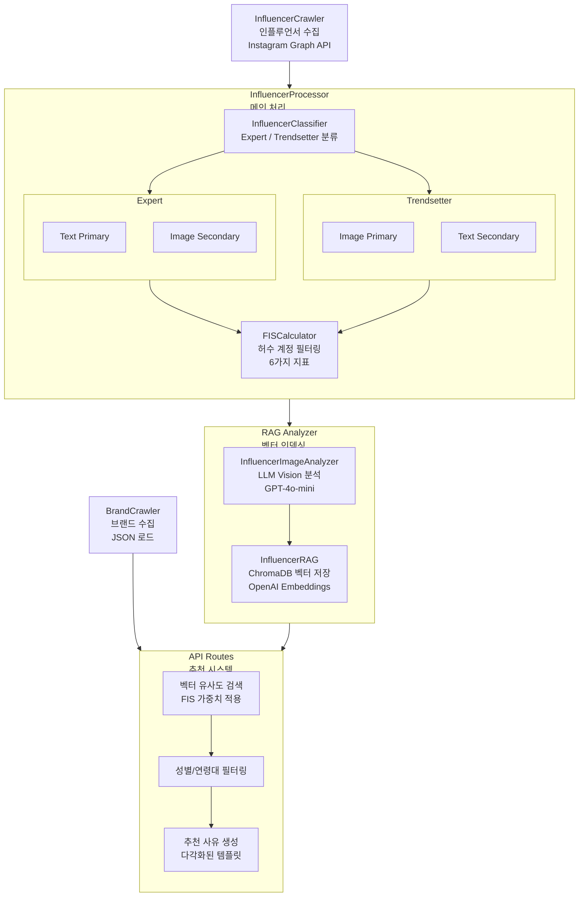

# 3. AI Agent 기능 및 구조

---

## 3.1 시스템 개요

본 시스템은 아모레퍼시픽 헤어 브랜드와 인스타그램 인플루언서를 자동으로 매칭하는 AI 에이전트이다. 마케팅 담당자가 브랜드와 캠페인 정보를 입력하면, 시스템은 인플루언서 풀에서 가장 적합한 후보를 선별하여 추천한다. 전체 파이프라인은 **데이터 수집, 처리, RAG 인덱싱, 벡터 검색, 추천**의 5단계로 구성된다.

---

## 3.2 파이프라인 구조



---

## 3.3 모듈별 기능

---

### 3.3.1 Crawlers - 데이터 수집

**BrandCrawler**는 아모레퍼시픽 헤어 브랜드 데이터를 관리한다. 브랜드 정보는 담당자가 공식 웹사이트를 조사한 후 직접 JSON 파일에 입력하는 방식으로 수집된다. 브랜드명, 슬로건, 핵심 가치, 미적 스타일, 가격대, 타겟 고객층 등의 정보를 정해진 스키마에 따라 저장하며, BrandCrawler는 이 데이터의 로드, 저장, 조회, 유효성 검사 기능을 제공한다.

**InfluencerCrawler**는 Instagram Graph API를 통해 인플루언서 데이터를 수집한다. 헤어 전문가 관련 해시태그(미용사, 헤어디자이너, 살롱 등)와 패션/라이프스타일 관련 해시태그(ootd, dailylook, 패션 등)를 기반으로 검색하되, Expert와 Trendsetter를 구분하지 않고 통합 수집한다. Business Discovery API로 프로필 정보와 최근 게시물을 가져와 `influencers_raw.json`에 raw 상태로 저장한다. 인플루언서 유형 분류와 분석은 Crawler의 역할이 아니며, 이후 Processor 단계에서 수행된다.

---

### 3.3.2 Processors - 데이터 처리

**InfluencerProcessor**는 Crawler에서 수집한 raw 데이터를 받아 분류, 분석, 검증을 수행하는 메인 파이프라인이다. 처리 흐름은 다음과 같다:

1. **분류 단계**: InfluencerClassifier를 사용하여 각 인플루언서를 Expert 또는 Trendsetter로 분류한다. bio 길이, caption 상세도, 전문가 키워드(원장, 디렉터, 년차, 자격증 등) 존재 여부를 기준으로 판별한다.
2. **분석 단계**: 분류된 유형에 따라 서로 다른 분석 전략을 적용한다.
    - **Expert형**: bio에 자격증과 경력 정보가 상세하고, caption에 시술 과정이나 레시피 같은 전문적인 내용이 담겨 있다. 따라서 텍스트 분석을 Primary로 수행하여 전문 분야, 자격증, 시술 기법을 추출하고, 이미지 분석은 Secondary로 텍스트에서 파악한 전문성이 실제 시술 결과물과 일치하는지 검증하고 보완한다.
    - **Trendsetter형**: bio가 짧거나 거의 비어 있고, caption도 해시태그 정도만 포함되어 텍스트에서 얻을 수 있는 정보가 제한적이다. 따라서 이미지 분석을 Primary로 수행하여 지배적 스타일, 컬러 팔레트, 미적 태그, 헤어 스타일 태그를 추출하고, 텍스트 분석은 Secondary로 해시태그 등 보조 정보만 추출한다.
3. **검증 단계**: FISCalculator를 통해 허수 계정을 필터링한다.
4. **저장 단계**: 최종 결과를 `influencers_data.json`에 저장한다.

**FISCalculator**는 허수 계정과 봇 계정을 탐지하여 필터링한다. Instagram Graph API를 통해 수집한 Reels 조회수 데이터를 활용하여 조회수 대비 좋아요/댓글 비율을 핵심 탐지 지표로 사용한다.

---

### 3.3.3 RAG Analyzer - 벡터 인덱싱 및 검색

**InfluencerImageAnalyzer**는 GPT-4o-mini Vision 모델을 사용하여 인플루언서의 게시물 이미지를 분석한다. 마케팅 활용 관점에서 인플루언서의 특성을 추출하며, 타겟 오디언스, 콘텐츠 특성, 헤어 특성, 제품 적합성, 프로모션 스타일 등을 JSON 형식으로 반환한다.

**InfluencerRAG**는 ChromaDB를 사용하여 인플루언서 프로필을 벡터화하고 저장한다. OpenAI의 text-embedding-3-small 모델로 임베딩을 생성하며, 메타데이터 필터링(성별, 연령대, 인플루언서 유형, FIS 점수)을 지원한다.

**InfluencerAnalysisManager**는 FIS 계산, Expert/Trendsetter 분류, 이미지 분석, RAG 인덱싱을 통합 관리하는 매니저 클래스다. 브랜드와 제품 정보를 기반으로 적합한 인플루언서를 검색하는 기능을 제공한다.

---

### 3.3.4 API Routes - 추천 시스템

**추천 API**는 RAG 벡터 검색 결과에 성별/연령대 필터링을 적용하고, 인플루언서별로 다각화된 추천 사유를 생성한다. 추천 사유는 콘텐츠 타입(시술결과, 튜토리얼, 일상브이로그 등), 광고 접근법(비포애프터, 전문가추천, 자연스러운PPL 등), 무드(세련된, 트렌디한, 미니멀 등)에 따라 3-4문장의 상세한 템플릿으로 생성된다.

---

# 4. AI Agent 개발 구현 과정

이 장에서는 3장에서 설명한 각 모듈의 내부 동작을 수학적 공식과 코드 수준에서 상세히 기술한다.

---

## 4.1 데이터 스키마

시스템에서 사용하는 데이터는 크게 **브랜드 데이터**와 **인플루언서 데이터**로 나뉜다.

인플루언서 데이터는 처리 단계에 따라 **Raw 데이터**와 **Processed 데이터**로 구분된다.

---

### 4.1.1 브랜드 데이터 스키마

브랜드 데이터는 담당자가 직접 입력한 정보를 JSON 형식으로 저장한다.

`BrandCrawler`가 이 파일을 관리하며, 추천 시 브랜드 정보를 기반으로 검색 쿼리를 생성한다.

---

#### 데이터 관리 방식

BrandCrawler는 웹 크롤링이 아닌 **수동 입력된 JSON 파일을 로드하고 관리하는 방식**으로 동작한다.

담당자가 공식 웹사이트를 조사한 후 정해진 스키마에 따라 `amore_brands.json`에 직접 입력한다.

```python
class BrandCrawler:
    def __init__(self, data_dir: str = None):
        self.data_dir = Path(data_dir) if data_dir else Path(__file__).parent.parent / "data"

    def load_brands(self) -> Dict:
        """저장된 브랜드 데이터 로드"""
        path = self.data_dir / "amore_brands.json"
        if path.exists():
            with open(path, 'r', encoding='utf-8') as f:
                return json.load(f)
        return {"brands": {}, "hair_brands": []}

    def get_brand(self, brand_name: str) -> Optional[Dict]:
        """특정 브랜드 정보 조회"""
        data = self.load_brands()
        return data.get("brands", {}).get(brand_name)

    def validate_brand(self, brand_data: Dict) -> Tuple[bool, List[str]]:
        """브랜드 데이터 유효성 검사"""
        required_fields = ["brand_name", "brand_name_en", "aesthetic_style", "price_tier"]
        missing = [f for f in required_fields if not brand_data.get(f)]
        return len(missing) == 0, missing
```

---

#### 스키마 구조

```json
{
  "brand_name": "미쟝센",
  "brand_name_en": "mise en scene",
  "slogan": "SHINE YOUR SCENE",
  "tagline": "나만의 스타일을 완성하다",
  "core_values": ["트렌디", "감각적", "셀프케어"],
  "brand_philosophy": "모든 순간을 빛나게",
  "target_keywords": ["MZ세대", "트렌드", "스타일링"],
  "aesthetic_style": "Trendy",
  "product_categories": ["샴푸", "트리트먼트", "에센스", "셀프염색"],
  "price_tier": "Mid-range",
  "age_target": "20-30대",
  "category": "Hair Care",
  "detail_url": "https://www.amorepacific.com/brands/mise-en-scene"
}
```

---

#### 필드 설명

| 필드 | 타입 | 필수 | 설명 |
| --- | --- | --- | --- |
| brand_name | string | O | 브랜드명 (한글) |
| brand_name_en | string | O | 브랜드명 (영문) |
| slogan | string | X | 브랜드 슬로건 |
| tagline | string | X | 짧은 태그라인 |
| core_values | string[] | X | 브랜드 핵심 가치 |
| brand_philosophy | string | X | 브랜드 철학 |
| target_keywords | string[] | X | 타겟 키워드 |
| aesthetic_style | enum | O | 브랜드 미적 스타일 |
| product_categories | string[] | X | 주력 제품 카테고리 |
| price_tier | enum | O | 가격대 |
| age_target | string | X | 타겟 연령층 |

---

#### aesthetic_style 값

| 값 | 설명 | 특성 |
| --- | --- | --- |
| Luxury | 고급스럽고 프리미엄한 이미지 | 아윤채 |
| Natural | 자연스럽고 친환경적인 이미지 | 려, 라보에이치 |
| Trendy | 트렌디하고 젊은 이미지 | 미쟝센, 롱테이크 |
| Classic | 전통적이고 클래식한 이미지 | 아모스 프로페셔널 |
| Minimal | 미니멀하고 깔끔한 이미지 | - |

---

#### price_tier 값

| 값 | 설명 | 해당 브랜드 |
| --- | --- | --- |
| Premium | 프리미엄/럭셔리 | 아윤채 |
| Mid-range | 중가 | 미쟝센, 롱테이크 |
| Professional | 전문가용 | 아모스 프로페셔널 |
| Mass | 대중 가성비 | 려, 라보에이치 |

---

### 4.1.2 인플루언서 데이터 스키마

인플루언서 데이터는 Instagram Graph API를 통해 수집되며, 처리 단계에 따라 **Raw 데이터**와 **Processed 데이터**로 구분된다.

---

#### 수집 방식

InfluencerCrawler는 Instagram Graph API의 Business Discovery API를 사용하여 인플루언서 데이터를 수집한다.

해시태그 검색으로 후보를 탐색한 뒤, 각 계정의 프로필과 최근 게시물을 조회한다.

---

#### API 호출 흐름

1. Hashtag Search API
    - 해시태그(#미용사, #헤어디자이너, #ootd 등)로 게시물 검색
    - 게시물 작성자의 username 수집

2. Business Discovery API
    - username으로 프로필 정보 조회
    - 팔로워 수, bio, 최근 게시물 12개 수집

3. Media Insights API (릴스인 경우)
    - 각 VIDEO 게시물의 조회수(plays) 조회

---

#### Business Discovery API 호출 예시

```python
def get_influencer_details(self, username: str) -> Optional[Dict]:
    """특정 인플루언서의 상세 정보 수집"""
    url = f"{self.base_url}/{self.business_account_id}"
    params = {
        "fields": f"business_discovery.username({username})"
                  "{username,name,biography,followers_count,media_count,"
                  "media.limit(12){id,caption,like_count,comments_count,"
                  "media_type,timestamp,media_url,permalink}}",
        "access_token": self.access_token
    }

    response = requests.get(url, params=params, timeout=15)
    response.raise_for_status()
    data = response.json()

    return self._normalize_influencer_data(data.get("business_discovery", {}))
```

---

#### 업로드 간격 계산

$$\text{avg\_interval} = \frac{1}{n-1} \sum_{i=1}^{n-1} \left( t_i - t_{i+1} \right), \quad t_1 > t_2 > \dots > t_n$$

```python
def _calculate_upload_interval(self, timestamps: List[str]) -> float:
    """평균 업로드 간격 계산 (일 단위)"""
    if len(timestamps) < 2:
        return 0.0

    dates = sorted([
        datetime.fromisoformat(ts.replace("Z", "+00:00"))
        for ts in timestamps
    ], reverse=True)

    intervals = []
    for i in range(len(dates) - 1):
        diff = (dates[i] - dates[i+1]).days
        intervals.append(diff)

    return sum(intervals) / len(intervals) if intervals else 0.0
```

---

#### 수집 필드와 API 소스

| 필드 | API | 설명 |
| --- | --- | --- |
| username | Business Discovery | 인스타그램 아이디 |
| followers | Business Discovery | 팔로워 수 |
| bio | Business Discovery | 프로필 소개글 |
| media_count | Business Discovery | 총 게시물 수 |
| recent_posts | Business Discovery | 최근 게시물 (최대 12개) |
| views | Media Insights | 릴스 조회수 (VIDEO만) |
| likes, comments | Business Discovery | 좋아요/댓글 수 |
| audience_countries | Account Insights | 팔로워 국가 분포 |
| avg_upload_interval_days | 계산값 | 게시물 간 평균 간격 |

---

#### Raw 데이터 (Crawler 출력)

Instagram API에서 수집한 원본 데이터다. Expert/Trendsetter 분류나 분석 결과가 포함되지 않은 상태다.

```json
{
  "username": "hair_master_kim",
  "followers": 85000,
  "bio": "청담동 헤어살롱 원장 | 15년차 미용사 | 염색 & 펌 전문 | 예약문의 DM",
  "media_count": 520,
  "recent_posts": [
    {
      "caption": "C컬 펌 시술 완료! 자연스러운 볼륨감이 포인트예요 #펌전문 #헤어디자이너",
      "media_type": "VIDEO",
      "media_url": "https://...",
      "timestamp": "2024-12-15T14:30:00+0000",
      "views": 45000,
      "likes": 3200,
      "comments": 89
    }
  ],
  "audience_countries": {
    "KR": 0.92,
    "US": 0.03,
    "JP": 0.02
  },
  "avg_upload_interval_days": 3.2
}
```

---

#### Processed 데이터 (Processor 출력)

InfluencerProcessor에서 분류와 분석을 완료한 데이터다. Raw 데이터의 모든 필드를 포함하며, 분류 결과와 FIS 점수가 추가된다.

```json
{
  "username": "hair_master_kim",
  "followers": 85000,
  "bio": "청담동 헤어살롱 원장 | 15년차 미용사 | 염색 & 펌 전문",
  "media_count": 520,
  "recent_posts": [ ... ],
  "audience_countries": { ... },
  "avg_upload_interval_days": 3.2,

  "influencer_type": "expert",
  "classification_confidence": 0.85,

  "fis": {
    "score": 87.5,
    "verdict": "신뢰 계정"
  }
}
```

---

## 4.2 Processors 상세

### 4.2.1 FISCalculator

FISCalculator는 허수 계정을 탐지하기 위한 Fake Integrity Score를 계산한다. Instagram Reels 조회수 데이터를 기반으로 6가지 지표를 분석한다.

**FIS 공식**

$$FIS = \left( w_V \cdot V + w_A \cdot A + w_E \cdot E + w_{ACS} \cdot ACS + w_{DUP} \cdot DUP \right) \times \frac{D}{100} + w_D \cdot D$$

**가중치 설정**

| 지표 | 변수 | 가중치 | 설명 |
| --- | --- | --- | --- |
| View Variability | $V$ | 0.20 | 조회수 변동성 |
| Engagement Asymmetry | $A$ | 0.25 | 좋아요/조회수 비율 (핵심) |
| Comment Entropy | $E$ | 0.15 | 댓글/조회수 비율 |
| Activity Stability | $ACS$ | 0.10 | 업로드 간격 |
| Geographic Consistency | $D$ | 0.15 | 지리적 정합성 |
| Duplicate Content | $DUP$ | 0.15 | 중복 콘텐츠 |

```python
class FISCalculator:
    def __init__(self):
        self.w_view = 0.20
        self.w_engagement = 0.25  # 핵심 지표
        self.w_comment = 0.15
        self.w_activity = 0.10
        self.w_geo = 0.15
        self.w_duplicate = 0.15

    def calculate(self, influencer: Dict) -> Dict:
        """FIS 점수 계산"""
        posts = influencer.get('recent_posts', [])

        v_score, v_detail = self._view_variability(posts)
        a_score, a_detail = self._engagement_asymmetry(posts)
        e_score, e_detail = self._comment_entropy(posts)
        acs_score, acs_detail = self._activity_stability(influencer)
        d_score, d_detail = self._geographic_consistency(influencer)
        dup_score, dup_detail = self._duplicate_content(posts)

        # 기본 점수 계산
        base_score = (
            self.w_view * v_score +
            self.w_comment * e_score +
            self.w_engagement * a_score +
            self.w_activity * acs_score +
            self.w_duplicate * dup_score
        )

        # 지리적 정합성 반영
        final_score = base_score * (d_score / 100) + (self.w_geo * d_score)
        final_score = max(0, min(100, final_score))

        # 판정
        if final_score >= 80:
            verdict = '신뢰 계정'
        elif final_score >= 60:
            verdict = '주의 필요'
        else:
            verdict = '허수 의심'

        return {
            'fis_score': round(final_score, 1),
            'verdict': verdict,
            'breakdown': { ... }
        }
```

---

#### 지표별 계산 방식

#### (1) View Variability (조회수 변동성)

변동계수(CV)로 조작된 조회수를 탐지한다. 뷰봇은 균일한 조회수 패턴을 보인다.

$$CV = \frac{\sigma}{\mu} = \frac{\sqrt{\frac{1}{n}\sum_{i=1}^{n}(v_i - \bar{v})^2}}{\bar{v}}$$

| CV 범위 | 점수 | 판정 |
| --- | --- | --- |
| < 0.03 | 30 | 뷰봇 강력 의심 |
| 0.03 ~ 0.05 | 55 | 뷰봇 가능성 |
| 0.05 ~ 0.08 | 75 | 경계 구간 |
| 0.08 ~ 0.50 | 95 | 정상 |
| > 0.50 | 80 | 변동 과다 |

```python
def _view_variability(self, posts: List[Dict]) -> Tuple[float, Dict]:
    """조회수 변동성 (CV)"""
    views = [p.get('views', 0) for p in posts if p.get('views', 0) > 0]

    if len(views) < 2:
        return 50.0, {'status': 'insufficient_data'}

    mean = sum(views) / len(views)
    variance = sum((v - mean) ** 2 for v in views) / len(views)
    cv = math.sqrt(variance) / mean if mean > 0 else 0

    if cv < 0.03:
        score = 30.0
    elif cv < 0.05:
        score = 55.0
    elif cv < 0.08:
        score = 75.0
    elif cv < 0.50:
        score = 95.0
    else:
        score = 80.0

    return score, {'cv': round(cv, 4)}
```

---

#### (2) Engagement Asymmetry (참여 비대칭성)

좋아요/조회수 비율로 뷰봇과 좋아요 구매를 탐지한다.

$$\text{Engagement Ratio} = \frac{\text{likes}}{\text{views}}$$

| 비율 | 점수 | 판정 |
| --- | --- | --- |
| < 0.8% | 25 | 뷰봇 강력 의심 |
| 0.8% ~ 1.5% | 45 | 뷰봇 가능성 |
| 2% ~ 12% | 90 | 정상 범위 |
| 12% ~ 18% | 75 | 참여율 높음 |
| 18% ~ 25% | 55 | 좋아요 구매 의심 |
| > 25% | 30 | 좋아요 구매 확실 |

비율의 CV가 0.05 미만이면 패턴 균일로 15점 추가 감점한다.

```python
def _engagement_asymmetry(self, posts: List[Dict]) -> Tuple[float, Dict]:
    """좋아요/조회수 비율 분석"""
    ratios = []
    for p in posts:
        views = p.get('views', 0)
        likes = p.get('likes', 0)
        if views > 0:
            ratios.append(likes / views)

    if not ratios:
        return 50.0, {'status': 'no_data'}

    avg = sum(ratios) / len(ratios)

    # 비율의 변동성 (봇은 일정한 패턴)
    if len(ratios) >= 2:
        variance = sum((r - avg) ** 2 for r in ratios) / len(ratios)
        cv = math.sqrt(variance) / avg if avg > 0 else 0
    else:
        cv = 0.1

    # 점수 계산
    if avg < 0.008:
        score = 25.0  # 뷰봇 강력 의심
    elif avg < 0.015:
        score = 45.0  # 뷰봇 가능성
    elif 0.02 <= avg <= 0.12:
        score = 90.0  # 정상 범위
    elif 0.12 < avg <= 0.18:
        score = 75.0  # 참여율 높음
    elif 0.18 < avg <= 0.25:
        score = 55.0  # 좋아요 구매 의심
    else:
        score = 30.0  # 좋아요 구매 확실

    # 비율 변동성이 너무 낮으면 봇 의심 (추가 감점)
    if cv < 0.05 and len(ratios) >= 3:
        score -= 15.0

    return max(0.0, min(100.0, score)), {'avg_ratio': round(avg * 100, 2), 'ratio_cv': round(cv, 4)}
```

---

#### (3) Comment Entropy (댓글 분석)

$$\text{View Ratio} = \frac{\text{comments}}{\text{views}}, \quad \text{Like Ratio} = \frac{\text{comments}}{\text{likes}}$$

| 조회수 대비 댓글 비율 | 점수 | 판정 |
| --- | --- | --- |
| < 0.05% | 35 | 댓글 부족 |
| 0.1% ~ 2% | 90 | 정상 |
| 2% ~ 5% | 70 | 댓글 다소 많음 |
| > 5% | 40 | 봇 댓글 의심 |

---

#### (4) Activity Stability (활동 안정성)

| 업로드 간격 (일) | 점수 | 판정 |
| --- | --- | --- |
| 1 ~ 7 | 90 | 정상 |
| 0.5 ~ 1 | 75 | 다소 빈번 |
| 7 ~ 14 | 80 | 다소 느림 |
| < 0.5 | 40 | 봇 의심 |
| > 14 | 60 | 비활성 |

---

#### (5) Geographic Consistency (지리적 정합성)

한국 타겟 인플루언서 여부를 확인한다. bio와 caption에서 한글 존재 여부와 한국 팔로워 비율을 함께 검토한다.

| 조건 | 점수 |
| --- | --- |
| 한국 타겟 + KR ≥ 70% | 95 |
| 한국 타겟 + KR ≥ 50% | 90 |
| 한국 타겟 + KR ≥ 35% | 80 |
| 한국 타겟 + KR < 35% | 65 |

---

#### (6) Duplicate Content (중복 콘텐츠)

Jaccard 유사도로 caption 중복을 탐지한다.

$$\text{Jaccard}(A, B) = \frac{|A \cap B|}{|A \cup B|}$$

70% 이상 유사하면 중복으로 간주하며, 동일 시간대(±5분) 게시 패턴도 자동화 의심 지표로 활용한다.

| 조건 | 감점 |
| --- | --- |
| 중복 비율 > 50% | -40 |
| 중복 비율 > 30% | -25 |
| 중복 비율 > 10% | -10 |
| 동일 시간 패턴 > 30% | -20 |
| 평균 유사도 > 50% | -15 |

**최종 판정**

| FIS 점수 | 판정 |
| --- | --- |
| ≥ 80 | 신뢰 계정 |
| 60 ~ 79 | 주의 필요 |
| < 60 | 허수 의심 |

---

### 4.2.2 InfluencerClassifier

InfluencerClassifier는 인플루언서를 Expert 또는 Trendsetter로 분류한다. bio와 caption에서 키워드를 추출하고 가중치를 적용하여 분류를 결정한다.

**키워드 및 가중치**

```python
EXPERT_KEYWORDS = [
    '미용사', '원장', '살롱', '시술', '예약', '펌', '염색약', '레시피',
    '컬러리스트', '헤어아티스트', '디렉터', '전문가', '자격증', '교육',
    '클리닉', '두피케어', '발레아쥬', '테크닉', '조색', '미용실'
]
EXPERT_WEIGHTS = {'원장': 3.0, '미용사': 2.5, '살롱': 2.0, '시술': 2.0, '디렉터': 2.5}

TRENDSETTER_KEYWORDS = [
    '스타일링', '데일리룩', 'OOTD', '추천', '꿀팁', '셀프', '홈케어',
    '트렌드', '패션', '일상', '크리에이터', '인플루언서', '협찬',
    '리뷰', '가성비', '꿀템', '솔직후기', '루틴', '유튜브'
]
TRENDSETTER_WEIGHTS = {'크리에이터': 2.5, '인플루언서': 2.5, '트렌드세터': 3.0, '협찬': 2.0}
```

**분류 알고리즘**

$$\text{Expert Score} = \sum_{kw} \text{count}(kw) \times \text{weight}(kw)$$

$$\text{Trend Score} = \sum_{kw} \text{count}(kw) \times \text{weight}(kw)$$

$$\text{Classification} = \begin{cases} \text{Expert} & \text{if Expert Score > Trend Score} \\ \text{Trendsetter} & \text{otherwise} \end{cases}$$

$$\text{Confidence} = \frac{\max(\text{Expert Score}, \text{Trend Score})}{\text{Expert Score} + \text{Trend Score}}$$

```python
def classify(self, influencer: Dict) -> Dict:
    """인플루언서 분류"""
    bio = influencer.get('bio', '')
    posts = influencer.get('recent_posts', [])
    captions = ' '.join([p.get('caption', '') for p in posts])
    full_text = f"{bio} {captions}"

    # 키워드 점수 계산
    expert_score = 0
    trend_score = 0

    for kw in self.EXPERT_KEYWORDS:
        count = full_text.count(kw)
        if count > 0:
            weight = self.EXPERT_WEIGHTS.get(kw, 1.0)
            expert_score += count * weight

    for kw in self.TRENDSETTER_KEYWORDS:
        count = full_text.count(kw)
        if count > 0:
            weight = self.TRENDSETTER_WEIGHTS.get(kw, 1.0)
            trend_score += count * weight

    total = expert_score + trend_score

    # 분류 결정
    if total == 0:
        classification = 'Trendsetter'
        confidence = 0.4
    else:
        expert_ratio = expert_score / total
        if expert_ratio > 0.5:
            classification = 'Expert'
            confidence = expert_ratio
        else:
            classification = 'Trendsetter'
            confidence = 1 - expert_ratio

    return {
        'classification': classification,
        'confidence': round(confidence, 3)
    }
```

---

## 4.3 RAG Analyzer 상세

### 4.3.1 InfluencerImageAnalyzer

GPT-4o-mini Vision 모델을 사용하여 인플루언서의 게시물 이미지를 분석한다. 마케팅 활용 관점에서 특성을 추출하며, Expert/Trendsetter 유형에 따라 다른 시뮬레이션 결과를 생성한다.

**LLM Vision 분석 프롬프트**

```python
IMAGE_ANALYSIS_PROMPT = """당신은 헤어/뷰티 마케팅 전문가입니다.
이 인플루언서의 콘텐츠 이미지들을 분석하여 마케팅 활용 관점에서 특성을 추출하세요.

**분석 관점:**
1. 이 인플루언서를 통해 어떤 제품을 홍보하면 좋을지
2. 어떤 타겟 오디언스에게 어필할 수 있는지
3. 어떤 분위기/무드의 캠페인에 적합한지
4. 어떤 메시지를 자연스럽게 전달할 수 있는지

**반드시 JSON 형식으로 응답하세요:**
{
  "influencer_persona": "이 인플루언서를 한 문장으로 정의",
  "target_audience": {
    "primary_gender": "female/male/unisex",
    "age_range": "20대 초반/20대 중후반/30대/40대 등",
    "lifestyle": "대학생/직장인/주부/프리랜서 등",
    "keywords": ["키워드1", "키워드2", "키워드3"]
  },
  "content_characteristics": {
    "main_mood": "세련된/자연스러운/화려한/미니멀/고급스러운 등",
    "visual_style": "밝은/어두운/따뜻한/차가운 등",
    "content_type": "일상브이로그/스타일링튜토리얼/GRWM/리뷰 등",
    "production_quality": "프로페셔널/세미프로/캐주얼"
  },
  "product_fit": {
    "best_categories": ["샴푸-볼륨", "트리트먼트-손상케어" 등],
    "suitable_brands_style": ["프리미엄", "내추럴", "트렌디" 등],
    "price_range_fit": "프리미엄/중가/가성비"
  },
  "promotion_style": {
    "ad_approach": "자연스러운PPL/리뷰형/튜토리얼형/감성형",
    "storytelling_strength": ["일상연출", "before-after" 등],
    "authenticity_level": "높음/중간/낮음"
  },
  "best_campaign_fit": [
    "어울리는 캠페인 유형 1",
    "어울리는 캠페인 유형 2"
  ]
}
"""
```

**분석 결과 구조**

| 필드 | 설명 |
| --- | --- |
| influencer_persona | 인플루언서를 한 문장으로 정의 |
| target_audience | 타겟 오디언스 정보 (성별, 연령대, 라이프스타일) |
| content_characteristics | 콘텐츠 특성 (무드, 스타일, 유형) |
| product_fit | 제품 적합성 (카테고리, 브랜드 스타일, 가격대) |
| promotion_style | 광고 스타일 (접근법, 스토리텔링) |
| best_campaign_fit | 적합한 캠페인 유형 |

---

### 4.3.2 InfluencerRAG

ChromaDB를 사용하여 인플루언서 프로필을 벡터화하고 저장한다.

**벡터 저장소 초기화**

```python
class InfluencerRAG:
    def __init__(self, db_path: str = None):
        self.db_path = db_path or str(Path(__file__).parent.parent / "data" / "influencer_rag")
        self.collection_name = "influencer_profiles_v2"
        self.api_key = os.getenv("OPENAI_API_KEY")
        self._init_db()

    def _init_db(self):
        """ChromaDB 초기화"""
        # Persistent client
        self.client = chromadb.PersistentClient(path=self.db_path)

        # OpenAI 임베딩 함수
        if self.api_key:
            self.embedding_fn = embedding_functions.OpenAIEmbeddingFunction(
                api_key=self.api_key,
                model_name="text-embedding-3-small"
            )
        else:
            self.embedding_fn = embedding_functions.DefaultEmbeddingFunction()

        # 컬렉션 생성
        self.collection = self.client.get_or_create_collection(
            name=self.collection_name,
            embedding_function=self.embedding_fn,
            metadata={"description": "인플루언서 마케팅 프로필 (FIS 포함)"}
        )
```

**인플루언서 인덱싱**

```python
def add_influencer(self, username: str, analysis: Dict, fis_score: float = 80.0, inf_type: str = "trendsetter"):
    """인플루언서 분석 결과를 RAG에 추가"""
    # 메타데이터 구성
    metadata = {
        "username": username,
        "influencer_type": inf_type,
        "fis_score": fis_score,
        "persona": analysis.get('influencer_persona', ''),
        "target_gender": analysis.get('target_audience', {}).get('primary_gender', ''),
        "target_age": analysis.get('target_audience', {}).get('age_range', ''),
        "main_mood": analysis.get('content_characteristics', {}).get('main_mood', ''),
        "content_type": analysis.get('content_characteristics', {}).get('content_type', ''),
        "best_categories": ','.join(analysis.get('product_fit', {}).get('best_categories', [])),
        "ad_approach": analysis.get('promotion_style', {}).get('ad_approach', ''),
        "campaigns": ','.join(analysis.get('best_campaign_fit', []))
    }

    # 검색용 텍스트 생성
    searchable_text = self._create_searchable_text(analysis, inf_type)

    # ChromaDB에 저장
    self.collection.upsert(
        ids=[username],
        documents=[searchable_text],
        metadatas=[metadata]
    )
```

**벡터 검색 (FIS 가중치 적용)**

```python
def search(self, query: str, top_k: int = 10, filters: Dict = None, min_fis: float = 60.0) -> List[Dict]:
    """쿼리로 적합한 인플루언서 검색"""
    # 필터 구성
    where_filter = None
    if filters:
        valid_filters = {k: v for k, v in filters.items() if v}
        if len(valid_filters) == 1:
            where_filter = valid_filters
        elif len(valid_filters) > 1:
            where_filter = {"$and": [{k: v} for k, v in valid_filters.items()]}

    # ChromaDB 쿼리
    results = self.collection.query(
        query_texts=[query],
        n_results=top_k * 3,  # FIS 필터링을 위해 더 많이 가져옴
        where=where_filter,
        include=["documents", "metadatas", "distances"]
    )

    # FIS 가중치 적용
    output = []
    for i, username in enumerate(results['ids'][0]):
        metadata = results['metadatas'][0][i]
        fis_score = metadata.get('fis_score', 80.0)

        # FIS 최소 점수 필터링
        if fis_score < min_fis:
            continue

        # 기본 유사도 점수
        base_score = 1 - results['distances'][0][i]

        # FIS 가중치 적용 (FIS가 높을수록 점수 향상)
        fis_weight = fis_score / 100.0
        weighted_score = base_score * (0.7 + 0.3 * fis_weight)

        output.append({
            'username': username,
            'score': weighted_score,
            'fis_score': fis_score,
            'influencer_type': metadata.get('influencer_type', 'trendsetter'),
            'metadata': metadata
        })

    # FIS 가중 점수로 재정렬
    output.sort(key=lambda x: x['score'], reverse=True)
    return output[:top_k]
```

**FIS 가중치 공식**

$$\text{Weighted Score} = \text{Base Score} \times \left( 0.7 + 0.3 \times \frac{\text{FIS}}{100} \right)$$

| FIS 점수 | 가중치 | 효과 |
| --- | --- | --- |
| 100 | 1.0 | 기본 점수 100% 반영 |
| 80 | 0.94 | 기본 점수 94% 반영 |
| 60 | 0.88 | 기본 점수 88% 반영 |

---

### 4.3.3 InfluencerAnalysisManager

FIS 계산, 분류, 이미지 분석, RAG 인덱싱을 통합 관리한다.

```python
class InfluencerAnalysisManager:
    def __init__(self):
        self.analyzer = InfluencerImageAnalyzer()
        self.rag = InfluencerRAG()
        self.fis_calculator = FISCalculator()
        self.classifier = InfluencerClassifier()

    def analyze_and_index_all(self, influencers: List[Dict], force_reanalyze: bool = False) -> Dict:
        """모든 인플루언서 분석 및 RAG 인덱싱"""
        stats = {'total': len(influencers), 'indexed': 0, 'experts': 0, 'trendsetters': 0}

        for inf in influencers:
            username = inf.get('username', '')

            # 1. FIS 점수 (기존 데이터 우선 사용)
            if 'fis' in inf and 'score' in inf['fis']:
                fis_score = inf['fis']['score']
            else:
                fis_result = self.fis_calculator.calculate(inf)
                fis_score = fis_result['fis_score']

            # 2. Expert/Trendsetter 분류 (기존 데이터 우선 사용)
            if 'influencer_type' in inf:
                inf_type = inf['influencer_type']
            else:
                classification = self.classifier.classify(inf)
                inf_type = classification['classification'].lower()

            # 3. 이미지 분석
            analysis = self.analyzer.analyze_influencer(inf)

            # 4. RAG 인덱싱
            self.rag.add_influencer(username, analysis, fis_score=fis_score, inf_type=inf_type)
            stats['indexed'] += 1

            if inf_type == 'expert':
                stats['experts'] += 1
            else:
                stats['trendsetters'] += 1

        return stats

    def search_influencers(
        self,
        brand_name: str,
        product_type: str = None,
        campaign_description: str = None,
        target_gender: str = None,
        influencer_type: str = None,
        min_fis: float = 60.0,
        top_k: int = 10
    ) -> List[Dict]:
        """브랜드 + 제품으로 적합한 인플루언서 검색"""
        # 검색 쿼리 구성
        query_parts = [brand_name]
        if product_type:
            query_parts.append(product_type)
        if campaign_description:
            query_parts.append(campaign_description)
        query = ' '.join(query_parts)

        # 필터 구성
        filters = {}
        if target_gender:
            filters['target_gender'] = target_gender
        if influencer_type:
            filters['influencer_type'] = influencer_type

        # RAG 검색
        return self.rag.search(query, top_k=top_k, filters=filters, min_fis=min_fis)
```

---

## 4.4 API Routes 상세

### 4.4.1 추천 API

RAG 검색 결과에 성별/연령대 필터링을 적용하고, 다각화된 추천 사유를 생성한다.

**추천 요청 모델**

```python
class RecommendRequest(BaseModel):
    """추천 요청"""
    brand_name: str
    product_type: Optional[str] = None
    product_line: Optional[str] = None
    description: Optional[str] = None  # 캠페인 설명
    target_gender: Optional[str] = None  # female/male/unisex
    expert_count: Optional[int] = 2  # 전문가 추천 수
    trendsetter_count: Optional[int] = 3  # 트렌드세터 추천 수
```

**추천 프로세스**

```python
@router.post("/recommend")
async def recommend_influencers(request: RecommendRequest):
    """인플루언서 추천 (RAG 기반)"""

    # 1. 전문가 검색
    expert_results = []
    if request.expert_count > 0:
        expert_results = _rag_manager.search_influencers(
            brand_name=request.brand_name,
            product_type=request.product_type,
            campaign_description=request.description,
            target_gender=request.target_gender,
            influencer_type='expert',
            top_k=request.expert_count * 3
        )

    # 2. 트렌드세터 검색
    trendsetter_results = []
    if request.trendsetter_count > 0:
        trendsetter_results = _rag_manager.search_influencers(
            brand_name=request.brand_name,
            product_type=request.product_type,
            campaign_description=request.description,
            target_gender=request.target_gender,
            influencer_type='trendsetter',
            top_k=request.trendsetter_count * 3
        )

    # 3. 성별 필터링
    expert_results = filter_by_gender(expert_results, request.target_gender)[:request.expert_count]

    # 4. 트렌드세터는 연령대 필터링도 적용
    trendsetter_results = filter_by_gender(trendsetter_results, request.target_gender)
    trendsetter_results = filter_by_age(trendsetter_results, request.description)[:request.trendsetter_count]

    # 5. 결과 병합 및 추천 사유 생성
    all_results = expert_results + trendsetter_results
    recommendations = []

    for r in all_results:
        recommendations.append({
            'username': r['username'],
            'match_score': calculate_match_score(r['score']),
            'rag_profile': r['metadata'],
            'match_reason': _generate_recommendation_reason(r['metadata'], brand_info, product_type),
            'influencer_data': get_influencer_data(r['username'])
        })

    return {'recommendations': recommendations, 'total_results': len(recommendations)}
```

**매칭 점수 스케일링**

```python
# 매칭 점수 스케일 조정 (65% ~ 98% 범위로 변환)
raw_score = r.get('score', 0.5)
match_score = min(98, max(65, 65 + raw_score * 40))
```

---

### 4.4.2 추천 사유 생성

콘텐츠 타입, 광고 접근법, 무드에 따라 다각화된 추천 사유 템플릿을 사용한다.

**Expert 추천 사유 템플릿 (시술결과/비포애프터)**

```python
if content_type == '시술결과' or ad_approach == '비포애프터':
    reasons = [
        f"시술 전후 비교 콘텐츠를 전문적으로 제작하는 헤어 전문가입니다. "
        f"{specialty} 분야에서 다년간 경험을 쌓으며 {display_age} 고객층에게 "
        f"높은 신뢰를 받고 있습니다. {product_type} 사용 전후의 변화를 시각적으로 "
        f"보여주는 콘텐츠로 '실제로 이렇게 달라진다'는 확신을 줄 수 있어 "
        f"구매 전환율이 높습니다.",

        f"Before & After 콘텐츠 전문 헤어 디자이너로, 시술 결과물의 퀄리티가 매우 높습니다. "
        f"{display_age} 고객을 주로 시술하며 해당 연령대의 모발 고민과 니즈를 정확히 "
        f"파악하고 있습니다. {product_type}의 효과를 실제 시술 과정에서 자연스럽게 "
        f"보여줄 수 있어, 단순 광고가 아닌 '전문가의 선택'으로 인식됩니다.",
        ...
    ]
```

**Expert 추천 사유 템플릿 (튜토리얼형)**

```python
elif content_type == '튜토리얼' or ad_approach == '튜토리얼형':
    reasons = [
        f"헤어 케어 튜토리얼 콘텐츠로 높은 인기를 얻고 있는 전문가입니다. "
        f"단순히 제품을 보여주는 것이 아니라 '왜 이 제품이 좋은지', "
        f"'어떻게 사용해야 효과적인지'를 단계별로 상세히 설명합니다. "
        f"{product_type}의 올바른 사용법과 기대 효과를 교육적으로 전달할 수 있어, "
        f"{display_age} 타겟층이 제품을 구매한 후에도 만족도가 높습니다.",
        ...
    ]
```

**Trendsetter 추천 사유 템플릿 (일상브이로그)**

```python
if content_type == '일상브이로그':
    reasons = [
        f"일상 브이로그로 팔로워들과 친밀한 관계를 형성하고 있는 인플루언서입니다. "
        f"아침 루틴, 외출 준비 등 일상 콘텐츠에서 자연스럽게 {product_type}을 노출하면 "
        f"광고처럼 느껴지지 않아 거부감이 적습니다. {display_age} {gender_kr} 팔로워들이 "
        f"'나도 저렇게 해봐야지'라는 공감을 하며 자연스럽게 구매 욕구가 생깁니다.",
        ...
    ]
```

**템플릿 선택 (해시 기반)**

```python
# 해시로 템플릿 선택 (같은 인플루언서는 항상 같은 템플릿)
hash_val = int(hashlib.md5(username.encode()).hexdigest(), 16) % len(reasons)
reason = reasons[hash_val]
```

---

## 4.5 제품 카테고리

### 4.5.1 카테고리 구조

```python
PRODUCT_CATEGORIES = {
    '샴푸': {
        'description': '모발 세정 제품',
        'target': 'consumer',
        'marketing_approach': 'consumer',
        'brands': ['려', '미쟝센', '라보에이치', '롱테이크'],
        'products': ['일반 샴푸', '탈모케어 샴푸', '두피케어 샴푸', '손상모 샴푸']
    },
    '트리트먼트': {
        'description': '모발 영양 및 집중 케어',
        'target': 'consumer',
        'marketing_approach': 'consumer',
        'brands': ['려', '미쟝센'],
        'products': ['데일리 트리트먼트', '손상모 트리트먼트', '헤어팩']
    },
    '두피케어': {
        'description': '두피 건강 및 탈모 예방 전문 케어',
        'target': 'both',
        'marketing_approach': 'expert_oriented',
        'brands': ['려', '라보에이치'],
        'products': ['두피 토닉', '두피 세럼', '두피 앰플', '탈모케어 앰플']
    },
    '살롱 케어': {
        'description': '살롱 전용 세정 및 케어',
        'target': 'professional',
        'marketing_approach': 'professional',
        'brands': ['아윤채', '아모스 프로페셔널'],
        'products': ['PRO 샴푸', 'PRO 트리트먼트', '살롱 클리닉']
    },
    '살롱 염색': {
        'description': '살롱 전용 염색 제품',
        'target': 'professional',
        'marketing_approach': 'professional',
        'brands': ['아윤채', '아모스 프로페셔널'],
        'products': ['프로페셔널 염색약', '산화제', '탈색제']
    },
    '기타': {
        'description': '기타 헤어 관련 제품',
        'target': 'both',
        'marketing_approach': 'consumer',
        'brands': ['려', '미쟝센', '라보에이치', '아윤채', '아모스 프로페셔널', '롱테이크'],
        'products': ['기타 제품', '신제품', '한정판', '기획세트']
    }
}
```

### 4.5.2 마케팅 접근법별 인플루언서 정책

| 마케팅 접근법 | 대상 제품 | 인플루언서 정책 |
| --- | --- | --- |
| professional | 살롱 케어, 살롱 염색, 살롱 펌 | Expert만 매칭 가능 |
| expert_oriented | 두피케어 | Expert 우선, Trendsetter 허용 |
| consumer | 샴푸, 트리트먼트, 에센스, 스타일링, 셀프염색, 헤어 프래그런스, 기타 | Trendsetter 우선 |

```python
MARKETING_APPROACH_CATEGORIES = {
    'professional': ['살롱 케어', '살롱 염색', '살롱 펌'],
    'expert_oriented': ['두피케어'],
    'consumer': ['샴푸', '트리트먼트', '에센스', '스타일링', '셀프염색', '헤어 프래그런스', '기타']
}
```
